# CloudSentinel 🛡️

**AI-Assisted Infrastructure Security Guardrail Auditor**

CloudSentinel is an enterprise-grade, API-first security platform designed to shift security left in modern cloud workflows. It provides automated, policy-based auditing for Infrastructure-as-Code (IaC) templates, ensuring that security misconfigurations are detected and blocked before they ever reach your cloud environment.

---

## 1. Project Introduction

In the era of Cloud Native and DevOps, infrastructure is defined by code. While this provides immense agility, it also introduces the risk of deploying "vulnerable by design" infrastructure. A single misconfigured S3 bucket or an open security group can lead to catastrophic data breaches.

**CloudSentinel** solves this problem by providing a centralized security guardrail. It intercepts infrastructure changes during the developer's commit process, evaluates them against organizational security policies using **Open Policy Agent (OPA)**, and provides immediate feedback. By shifting security to the very beginning of the development lifecycle, CloudSentinel reduces the cost and risk associated with cloud misconfigurations.

---

## 2. Features

- **Multi-Provider IaC Scanning**: Support for Terraform (HCL) and CloudFormation (YAML/JSON).
- **OPA/Rego Policy Engine**: Decoupled policy-as-code evaluation for flexible and extensible security rules.
- **Git Pre-Commit Enforcement**: Automated interception and blocking of insecure commits.
- **Deduction-Based Security Scoring**: A sophisticated scoring model that calculates the overall security posture of infrastructure files.
- **Security Observability Dashboard**: A modern, Streamlit-based dashboard for global analytics, trends, and file-level analysis.
- **FastAPI Service Layer**: Scalable, modular backend architecture for scanning and analytics.
- **Audit Persistence**: SQLite-backed historical tracking of all scans and vulnerability findings.
- **Modular Parser Architecture**: Extensible design allowing for easy addition of new IaC providers.

---

## 3. Architecture Overview

CloudSentinel follows a modular, decoupled architecture designed for performance and extensibility.

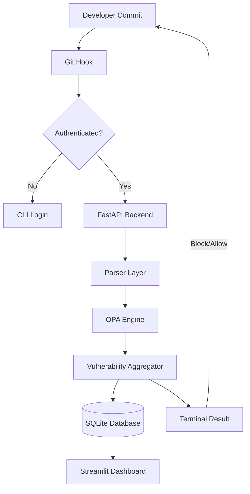

---

## 4. How the System Works

1.  **Interception**: When a developer runs `git commit`, the CloudSentinel pre-commit hook identifies staged `.tf`, `.yaml`, or `.json` files.
2.  **Authentication**: The hook verifies the local API token. If missing, the developer is prompted to authenticate via the CLI.
3.  **Submission**: Staged files are sent to the FastAPI backend.
4.  **Parsing & Normalization**: The backend Parser Layer converts provider-specific syntax into a normalized JSON representation.
5.  **Policy Evaluation**: The OPA Engine evaluates the normalized data against a library of Rego policies.
6.  **Scoring & Persistence**: The system calculates a security score based on findings, records the scan results in SQLite, and determines if the commit should be blocked.
7.  **Reporting**: Results are rendered in the developer's terminal, and the global dashboard is updated in real-time.

---

## 5. Git Pre-Commit Enforcement Flow

CloudSentinel's primary guardrail is the local git hook. This ensures that no insecure infrastructure code is ever committed to the repository.

### Interception & Evaluation
The hook detect files in the `staged` state. It sends the raw content to the `/scan` endpoint. If the scan returns **Critical** or **High Risk** findings, the hook exits with a non-zero code, effectively blocking the commit.

### Terminal Experience
CloudSentinel provides a professional terminal UI using a custom renderer. Findings are categorized by severity with clear remediation guidance.


*Example: A developer attempt to commit a public S3 bucket is intercepted and blocked.*

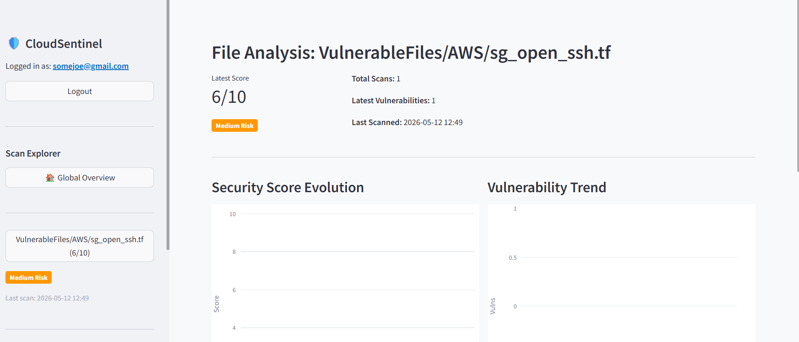
*Professional terminal rendering of security violations.*

---

## 6. OPA / Rego Policy Engine

CloudSentinel utilizes **Open Policy Agent (OPA)** to implement "Policy-as-Code".

- **Decoupled Logic**: Security policies are written in Rego and stored separately from the application logic.
- **Extensibility**: Adding a new security rule is as simple as dropping a new `.rego` file into the policies directory.
- **Normalization**: The backend ensures that whether you are scanning Terraform or CloudFormation, the OPA engine receives a consistent data structure.

---

## 7. Security Scoring System

CloudSentinel implements a **Deduction-Based Scoring Model** to provide a clear metric for infrastructure security.

### How it Works:
1.  **Base Score**: Every file begins with a perfect score of **10.0**.
2.  **Deductions**: Each detected vulnerability reduces the score based on its severity:
    - **Critical (Severity 9-10)**: -4.0 points
    - **High (Severity 7-8)**: -2.0 points
    - **Medium (Severity 4-6)**: -1.0 points
    - **Low (Severity 1-3)**: -0.5 points
3.  **Final Posture**: The final score is used to classify the file's overall security posture:
    - **10**: Secure
    - **8-9**: Low Risk
    - **5-7**: Medium Risk
    - **3-4**: High Risk
    - **≤ 2**: Critical

> [!NOTE]
> File-level posture is distinct from individual vulnerability severity. A file with five "Low" vulnerabilities may result in a "Medium Risk" posture, even if no single vulnerability is critical.

---

## 8. Dashboard and Analytics

The CloudSentinel Dashboard is a security observability platform built with Streamlit. It provides a high-level view of the organization's security health.

### Global Command Center
- **Severity Distribution**: Real-time breakdown of security posture across all scanned files.
- **Provider Split**: Visualization of infrastructure footprint across cloud providers (AWS, Azure, etc.).
- **Security Trends**: Organization-wide average security score evolution over time.

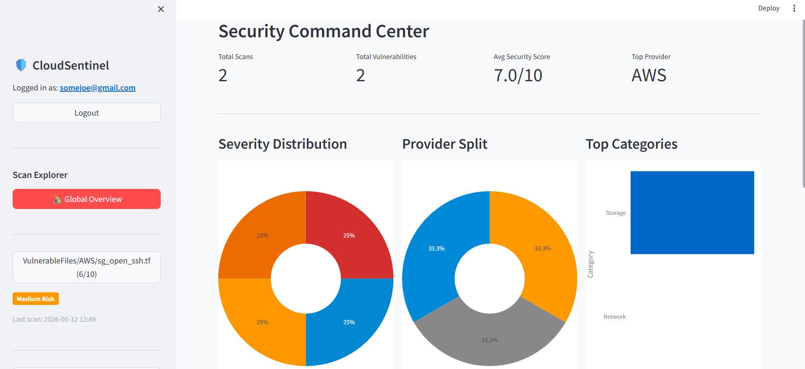

### File-Level Deep Dive
Developers and auditors can select specific files to view their full scan history, score evolution, and detailed remediation steps for every finding.

````carousel
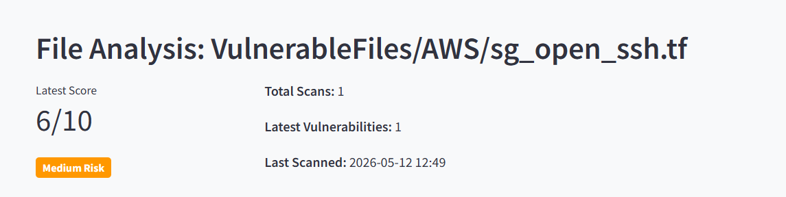
<!-- slide -->
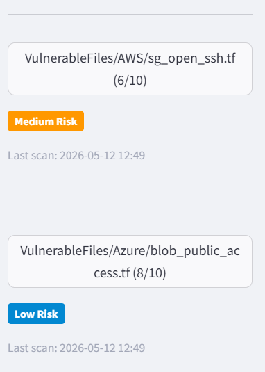
<!-- slide -->
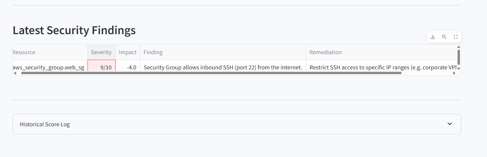
````

---

## 9. Step-by-Step Reproduction Guide

### 1. Environment Setup

```bash
# Create and activate virtual environment
python -m venv venv
.\venv\Scripts\activate  # Windows
source venv/bin/activate # Linux/macOS

# Install dependencies
pip install -r requirements.txt
```
Example Faulty Terraform File
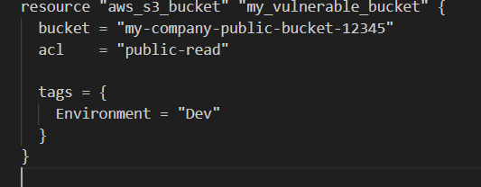
### 2. Start the Services

```bash
# Terminal 1: Start FastAPI Backend
uvicorn backend.main:app --reload

# Terminal 2: Start Streamlit Dashboard
streamlit run dashboard/app.py
```

### 3. CLI Authentication
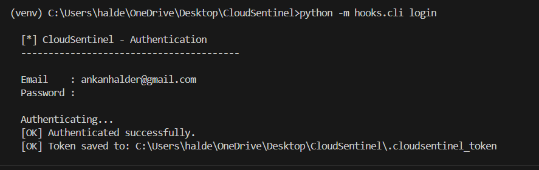
```bash
# Authenticate with the local scanner
python -m hooks.cli login
```

### 4. Trigger the Guardrail
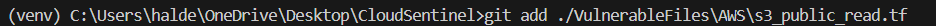
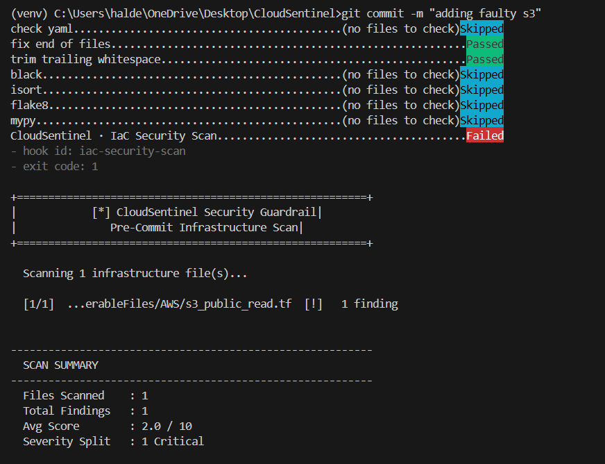
```bash
# Stage a vulnerable file
git add VulnerableFiles/AWS/s3_public_read.tf

# Attempt to commit
git commit -m "Add new storage bucket"
```

### 5. Observe Results
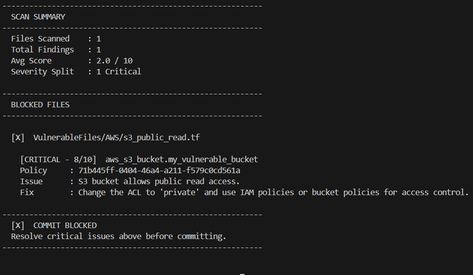
The terminal will display a detailed vulnerability report. If the file is insecure, the commit will be blocked.

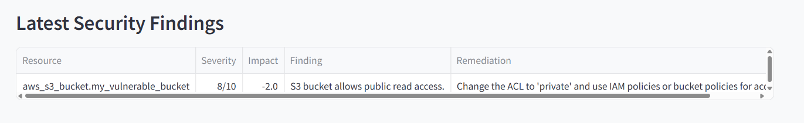
You can then view the aggregated results in the dashboard.

---

## 10. Directory Structure

```text
CloudSentinel/
├── backend/                # FastAPI Application
│   ├── api/                # Route Handlers
│   ├── models/             # SQLAlchemy ORM Models
│   ├── services/           # Business Logic & Aggregation
│   └── core/               # Parser Layer & OPA Integration
├── dashboard/              # Streamlit Frontend
├── hooks/                  # Git Hooks & CLI Tooling
├── OPAPolicies/            # Rego Policy Library
├── VulnerableFiles/        # Sample Insecure IaC Templates
└── requirements.txt        # Project Dependencies
```

---

## 12. Parser Architecture

CloudSentinel uses an **Abstract Parser Interface** to handle various IaC formats.

- **`BaseParser`**: Defines the shared contract for parsing IaC files into normalized JSON.
- **`TerraformParser`**: Handles `.tf` files using HCL parsing logic.
- **`CloudFormationParser`**: Handles YAML/JSON templates.

This design allows the scanning engine to remain agnostic of the underlying IaC syntax.

---

## 13. API and Service Layer Design

The backend is built with a strict separation of concerns:
- **Routes**: Handle HTTP requests and schema validation (Pydantic).
- **Services**: Orchestrate the scanning process and perform analytics aggregation.
- **Models**: Define the database schema and relationships.
- **Core**: Contains the heavy lifting for parsing and policy evaluation.

---

## 14. Database Design

CloudSentinel uses SQLite for its MVP scope, with a relational schema optimized for security auditing.

- **Users**: Authentication and identity management.
- **Tokens**: API access management.
- **Scans**: Metadata for every scan performed (time, status, file).
- **Vulnerabilities**: Detailed findings linked to specific scans.

---

## 15. How to Write Policies

Adding a new security rule is straightforward. Create a new `.rego` file in `OPAPolicies/`:

```rego
# Example: Block public S3 buckets
package cloudsentinel.aws.s3

deny[msg] {
    resource := input.resources[_]
    resource.type == "aws_s3_bucket"
    resource.properties.acl == "public-read"
    msg := {
        "resource_name": resource.name,
        "severity": 9,
        "message": "S3 bucket has public-read ACL enabled.",
        "remediation": "Change ACL to 'private'."
    }
}
```

---

## 16. Limitations and MVP Scope

- **Local Execution**: The current version relies on a locally running FastAPI server.
- **Provider Coverage**: Initial focus on core AWS and Azure resources.
- **Synchronous Scans**: Scans are performed synchronously during the commit process.
- **Simplified Auth**: Token-based authentication designed for local developer workflows.

---

## 17. Future Improvements

- **CI/CD Integration**: Official GitHub Actions and GitLab CI support.
- **Asynchronous Scanning**: Background task processing for large infrastructure repositories.
- **AI-Assisted Remediation**: Integration with LLMs to provide custom code fixes for detected vulnerabilities.
- **PDF Reporting**: Automated generation of security audit reports for compliance teams.
- **RBAC**: Fine-grained Role-Based Access Control for large security teams.

---

## 18. Credits

Developed by the **Antigravity** team at **Google DeepMind** as a demonstration of AI-assisted security engineering.
